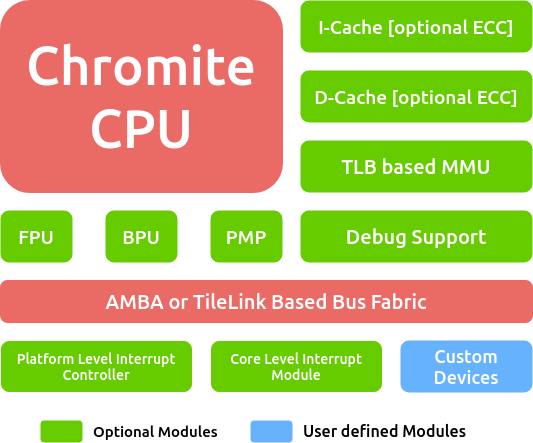

Overview
========

.. _system_level:

   Chromite Processing System

The Chromite Core is an extremely configurable and synthesizable RISC-V ISA :cite:`riscv` based in-order core.
The configurability of the core enables generation of a range of cores, from  a tiny core targeted for power constrained IoT, to 
embedded and edge application cores and  all the way to feature rich high-performance cores
suitable for power optimized linux/mobile applications. :numref:`system_level` shows the system level diagram of the
Chromite core.

