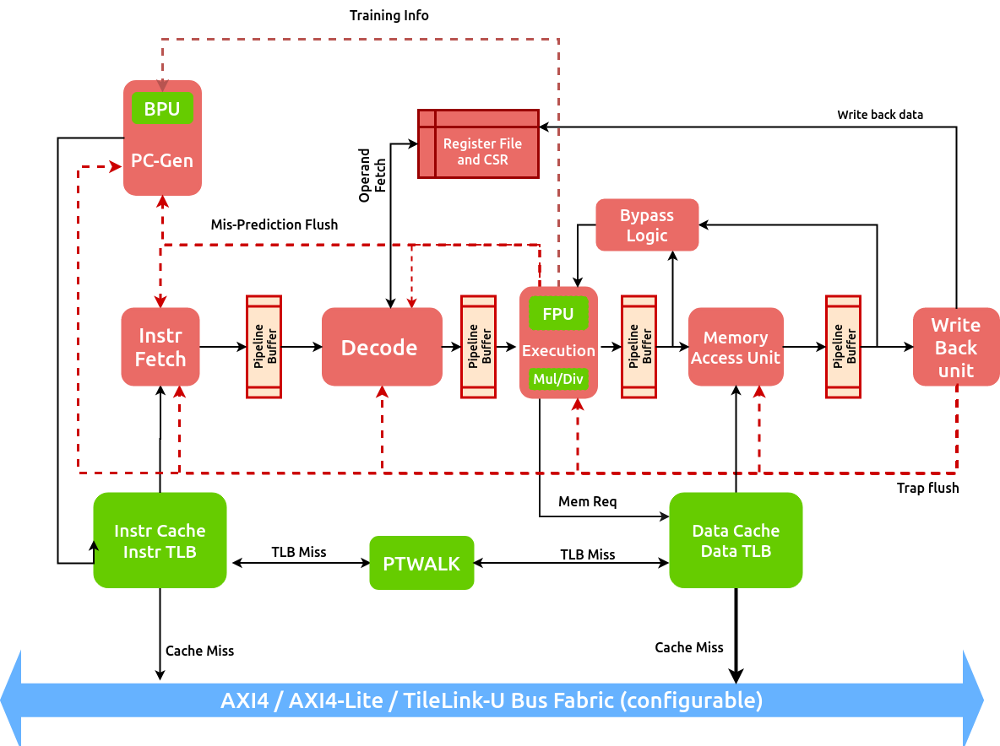

Core Pipeline Architecture
==========================
The core pipeline consists of **PC gen, instruction fetch, decode, execution, 
write-back and redirection** stages. These modules are described in the following sections. 

   Chromite Pipeline Diagram

PC Gen Unit
-----------
The PC Gen module generates the next value of the Program Counter (PC). 
It also incorporates the Branch Predictor Unit (BPU). The next PC is generated either as 
the subsequent intruction address (PC+4) or as the 
address obtained from the outputs of the branch predictor and any re-directions received
from the pipe in the same cycle. The address calculated by this module decides 
the next pc for the cache and the instruction fetch-stage.

To achieve high-performance, a gshare based global branch predictor is
implemented in this stage.It comprises of a fully-associative Branch
Target Buffer (BTB) (up to 64 entries), a Branch History Table (BHT) (up to 512 entries) and a
Return Address Stack (RAS) (up to 16 entries)
The BTB is trained with all control instructions, but holds the target only for
conditional branches and call instructions. The target addresses for return intructions is
maintained in the RAS.

When compressed instructions are supported, the BPU provides prediction for 2 PCs. This module is
also responsible for ensuring that if an instruction straddles  a 4-byte boundary (within the
same or different cache line), the correct
sequence of addresses are generated to the cache and relevant information is passed to the
instruction fetch unit.

Instruction Fetch Unit
----------------------
The instruction fetch unit is responsible for fetching the instructions from cache. The block receives 32-bit 
responses from the cache. When compressed instructions (16-bit) are supported, the 32-bit received from the
cache can be a combination of both compressed and non-compressed instructions and thus involves a
small sate-machine to deduce this information. In case a compressed instruction is received, it is
decompressed to an equivalent 32-bit instruction before being passed on to the decode unit.
This unit also detects any instructions triggers, if set. Information of any faults (instruction 
access or page-faults) received from the cache are simply passed onto the next stage along with the
instruction.

Decode Unit
-----------
The decode unit decodes the 32-bit instruction received from the fetch-stage and also performs operand
fetch from the register-file. The core consists of 32 general purpose integer registers of XLEN (32/64 bit) size.
If floating point support is enabled in hardware, then another 32 floating point registers of FLEN (32/64 bit) size
are also available. The integer register-file consists of two read-ports and one write port. The
floating point register-file on the other hand requires three read-ports and one write port (to support
floating point multiply-accumulate operations). To reduce operation latency in the pipeline, the register
file also supports full-bypass.

All interrupts (local or external) are detected in this unit. Illegal
traps and traps received from the previous stage are captured here and processed  for the
next stage. 

When a WFI (Wait for Interrupt) instruction is detected, the pipeline is stalled from the next
cycle . The pipeline resumes functionality only when an interrupt (local or external) is
detected. 

Since all CSR operations flush the pipeline, when a CSR instruction or a trap is detected, the decode 
unit stalls until a re-direction signal is received from either the execution unit or the
write-ba ck unit.

Execution Unit
--------------
To increase throughput, the execution unit implements a simple operand-bypass scheme which receives updated
operands from the subsequent stages, before they are committed. The unit also instantiates a
single-cycle ALU to perform arithmetic and logical operations (e.g. ADD, SUB, XOR, Shift).

All branches and mispredictions are evaluated in this stage and a re-direction signal is generated
to the previous stages to re-start fetch and drop fetched instructions. If the branches lead to a
mis-aligned address (in cases where compressed is not supported), the module captures them as traps. 

The unit also uses a separate 64/32-bit adder to generate the memory access address. If the
effective address is mis-aligned then the unit captures it as a trap.

Multiply/Divide Unit
^^^^^^^^^^^^^^^^^^^^
The execution unit  utilizes a multi-cycle integer multiply / divide unit to support the M
instruction extension of RISC-V. The multiplier is implemented as a retimed module whose latency can
be configured at design time. The divider on the other hand implements a non-restoring algorithm
which produces output with a variable latency, but a maximum of XLEN (64/32). SRT based high performance 
dividers are also available and can be chosen at design time.

Floating Point Unit
^^^^^^^^^^^^^^^^^^^

The optional floating point unit (FPU), compliant with the IEEE-754 2008 standard is also
instantiated within the execution unit. The FPU supports single and double precision computations,
with denormals handling and all six standard rounding modes.

The FPU uses a retimed fused-multiply-accumulate unit to perform addition, subtraction and FMA operations. 
The latency of the pipeline can be configured at design time. When double precision is enabled at design time,
the unit itself performs the single-precision operations with additional conversion latencies. The FPU uses variable latency, iterative units to
perform division and square-root.

Blocking nature of Execute
^^^^^^^^^^^^^^^^^^^^^^^^^^
Since chromite is an in-order core and utilizes a simple operand bypassing scheme, at any instant of
time only a single instruction can be executing within the execution unit.

Memory and Write-back Units
---------------------------

The memory unit bypasses all non-memory instruction and otherwise waits for a response from the data
cache. The write-back stage updates the register file, and also handles traps. In case of traps,
the respective CSRs are updated as described in the privileged RISC-V ISA spec, and a re-direction
to the trap vector is initiated causing a flush of the pipeline. 

Handling Re-directions
----------------------

The execution unit and the write-back unit are capable of generating re-direction signals causing
the entire pipeline to be flushed. The execution unit generates a redirection in the case of
branch mis-prediction (if the BPU is enabled), or for control flow instructions that are taken (if
BPU is disabled). The write-back stage on the other hand will generate re-directions for traps 
if an instruction (such as CSR ops) require a re-run of the subsequent instructions.
TODO: What about actual traps and interrupts?

To account for this with least impact on timing and area, the pipeline implements epoch registers
within each pipeline stage. The epoch register is maintained constant (madhu reword) for a stream 
of instructions until a re-direction is generated from pipeline. The re-directions cause the epochs
to toggle and thus, each stage will either process the instruction if the epoch values matches or 
else drop the instruction on a mis-match.
