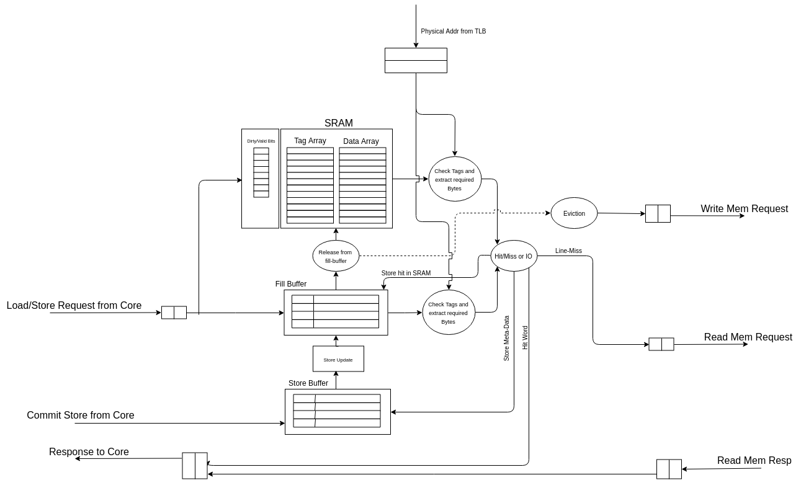

.. _l1_caches:

#################
L1 Cache Subsytem
#################

The Instruction Memory Subsystem (IMS) includes the L1 instruction caches and the instruction 
memory management unit. The data memory subsystem (DMS) includes the data
caches and the data memory management unit.

This chapter discusses the L1 caches and its operating theory in detail.

The L1 caches are blocking in nature. The default cache configurations are given below:

.. table:: Default Instruction Cache configuration

   ===============  ===================================
   Parameter        Value     
   ===============  ===================================
   Ways             4        
   Sets             64        
   Blocksize        16 32-bit words 
   Fillbuffer size  4      
   Buswidth         64    
   Replacement      PLRU        
   ===============  ===================================

To prevent aliasing issues, the size of each way should not cross 4kiB.

The caches are designed to use single ported (i.e. 1RW) RAM structures for better delay, area and
power. The access to the RAMs require two cycles: one cycle for the actual read of the RAM,
and another cycle for tag comparison, hit determination and way selection.

The caches also include an array of fill-buffers which hold the lines coming from
the lower level memories.  The entries in the fill-buffer are released into the RAMs either when 
the fill-buffer is full or when there is an opportunity where the cache is not receiving requests 
from the core pipeline. 

In case of the data cache, the write-policies followed are write-back and write-allocate. 
The fill-buffers in the data-cache also hold the lines on which stores need to be performed. 

The load to use latency of the data-cache is 1 clock cycle. 

Cache Feature List
==================

Following is a quick list of features for the L1 caches.

* The caches follow a write-back policy. This reduces the traffic to the next-level caches.
* The caches are designed to use Single-ported SRAMs/BRAMs (1RW configuration) for data and 
  tag arrays. This means that at any given cycle the SRAMs can either perform a read or a write. 
  This choice improves the area,latency and power consumption of the entire cache since 
  SP-SRAMs are the lightest-configurations available with a foundry/FPGA.
* The caches also assume that the SRAMs follow a *NO_CHANGE* policy for the read-ports, where only 
  a read-access can cause a change in the output ports. More info on this can be found under the
  *Operating Mode* subsection of Chapter 3 of the *Block Memory Generator v8.3, LogiCORE IP Product 
  Guide* from Xilinx.
* These are blocking caches. If a miss is encountered, the caches can latch only one more request 
  from the core which will get served only after the previous miss has been served.
* On a cache-line miss, the caches expect the fabric/bus to respond with the critical word first.
* The caches can be disabled at runtime by clearing the corresponding bits in custom control csr
  defined in :numref:`custom_control_csr`.
* To ensure pipeline-like performance and high-throughput from the above choices, the caches also 
  include a **fill-buffer**. The fill-buffer depth can be configured at compile time. 
  The fill-buffer is used to hold cache lines temporarily under the following scenarios:

  * When there is a line-miss in the cache, a fill-buffer entry gets allotted to the line and the 
    response from the fabric/bus occupies that entry in the fill-buffer.
  * When a store/atomic-request is made by the core, if a hit-occurs in the SRAMs, the respective 
    line is transferred from the SRAMs to the fill-buffer. Thus, the store is always performed in 
    the fill-buffers and not the SRAMs. This design avoids the contention of the SRAM ports by the 
    core for load and stores.
  * When the fill-buffer is full or if the cache is idle, the fill-buffer will release some of the 
    lines into the SRAMs. The opportunistic-release algorithm (discussed later) ensures that 
    fill-buffer does not reach its capacity often.
  * It is only during the release from the fill-buffer that a line from a set gets allotted or 
    evicted.

* Round-robin, PLRU and Random replacement policies are supported (which need to be defined at 
  compile time). The policy only comes into picture during a release of the fillbuffer. 
* The valid and dirty bits are stored as an array of registers instead. 
  This enables a single-cycle flush operation for a instruction cache and a non-dirty data cache. 
  Storing them as register also enables easy control flow-logic for the fill-buffer 
  during allocation and release phases.
* For data cache, during a fence operation, a set can be skipped by simply checking for valid and 
  dirty bits, thereby improving the penalty of a fence operation. A global-dirty bit is also 
  maintained to check if the fence can be completed within a single cycle similar to the data cache.
* The data cache also employs a store-buffer. This buffer holds the meta-data of 
  the store/atomic operation to be performed by the core during the execute/memory stage of the 
  core-pipeline. The write-back stage of the core instructs the cache to perform the respective 
  store in the fill-buffer, or simply discard the store entry in case of a previous trap.
* The physical tags for comparison are received from the respective TLBs. The size of the tags 
  depends on the physical address size being employed by the platform. RISC-V ISA can support a 
  maximum of 56-bit physical address for sv39.
* The caches without ECC do not generate any exceptions internally. Access exceptions are received 
  from the fabric and page-faults are captured by the TLBs.
* The caches also support capturing the following events for performance-counters:

    1. Total number of accesses
    2. Total line-hits in SRAMs
    3. Total line-hits in Fill-buffer
    4. Total Non-cacheable Accesses
    5. Total number of Loads (for data cache)
    6. Total number of Stores (for data cache)
    7. Total number of Atomic (for data cache)
    8. Total number of Evictions ignoring Fence-based-evictions.
    9. Total number of Fence requests.

:numref:`l1_cache_diag` shows the block diagram of the L1 cache.

.. _l1_cache_diag:

  L1 Cache Micro Architecture

Theory of Operation
===================

A request from the core is enqueued into a request FIFO (`ff_core_request`). On a hit within the 
cache, the required word is enqueued into the response FIFO (`ff_core_response`) which is read 
by the core. On a miss, a read request for the line is sent to the fabric via the 
`ff_read_mem_request` and simultaneously an entry in the fill-buffer is allotted to capture the 
fabric response. The responses from the fabric are enqueued in the `ff_read_mem_response` FIFO. 
When a dirty line needs to be evicted, a write request for that line is enqueued into 
`ff_write_mem_request` FIFO and the response of this write is captured in `ff_write_mem_response` FIFO.

.. note:: Though the description below is presented for data cache, the instruction cache also works in the 
  similar fashion where the requests are treated similar to a Load-request.

**Serving core requests**
  A core request can only be enqueued in `ff_core_request` FIFO if the following conditions are true :- 
  
  1. Fill-buffer is not full.
  2. Core is ready to receive a response or deq the previous response
  3. Fence operation is not in progress.
  4. A replay of SRAM tag and data request (for a previous request) is not happening 
     (its necessity is discussed in later sections).
  
  The reason for point 1 and 2 being, once either of the two structures are full, a hit or a miss 
  cannot be processed further. In this situation, if there is one outstanding request already 
  present in `ff_core_request`, enqueuing one more request would overwrite the SRAM tag and data 
  values of the previous one. When tag matching resumes, incorrect tag would be used leading to 
  incorrect behaviour.
  
  Once a request is enqueued into the `ff_core_request` FIFO, a tag and data read request is sent 
  to the SRAMs simultaneously. In the next cycle, if there isn't a pending request and fill-buffer 
  & ff_core_response are not full, the tag field of the request is compared with the tags stored 
  in the SRAMs (tag field of all the ways for particular set) and the fill-buffer 
  (tag field of all the entries). 
  
  A hit occurs in following scenarios :- 1. Tag matches in SRAM 2. Address matches in fill-buffer 
  and also the requested word is present. There might be a case where tag matches in fill-buffer 
  but the word is not present as the line is still getting filled by the fabric. In that case we 
  keep polling on the fill-buffer until there's a **word-hit**. A miss occurs when tag match fails 
  in both the SRAM and the fill-buffer.
  
  .. note:: A tag-hit can occur either in the SRAM or the fill-buffer and never both. Assertions to 
     check this have been put in place. 

  From the above the following 4 scenarios can occur:

  1. **For a Load request**: if it's a hit, the requested word is enqueued in `ff_core_response` 
     FIFO in the same cycle as the tag-match. When it's a hit in the FB, before enqueuing the 
     response, we check if there is a pending store to the same word, if so we enqueue the updated 
     word accordingly. Since, the SRAMs are not updated with stores immediately, the store-buffer 
     is looked up only in the case of a fill-buffer hit.
  2. **For a Load request**: If it's a miss, the address (after making it word aligned) is 
     enqueued into the `ff_read_mem_request` FIFO to be sent to fabric. Simultaneously, a 
     fill-buffer entry is assigned to capture the line requested from the fabric. Once the 
     requested word is captured in the fill-buffer (while rest of the line is still getting filled), 
     it is enqueued into the `ff_core_response` to be sent to core and the entry in `ff_core_request` 
     is dequeued. We are now ready to service the subsequent request in the next cycle.
  3. **For a store request**: If it's a hit in the fill-buffer, a store buffer entry is allotted 
     to store the data to be written and response is enqueued in the `ff_core_response` FIFO 
     (response being that it is store hit). If it's a hit in the SRAM, in addition to performing 
     actions that of a fill-buffer hit, the line is copied into the fill-buffer 
     (since all stores are performed here) while making it invalid in the SRAM.
  4. **For a store request**: If it's a miss, request would be sent to fabric as was when load 
     miss occurred. Once the requested word is captured in the fill-buffer, the actions that 
     follow are similar to those of store hit in fill-buffer.
  5. **For atomic requests**: The control is similar to that store-requests apart from the fact 
     that the updated word undergoes arithmetic op before being written in the store-buffer.

**Release from fill-buffer**
  The necessary condition for a release of a line from fill-buffer and its updation into SRAM is 
  that the line itself is valid and all the words in the line are present and updated by 
  store-buffer if necessary. If there is any pending store in the store buffer, the line won't be 
  released. Given this is true, following conditions would initiate a release :- 
  
  1. **Fill-buffer is full**. A release is necessary in this case since no more requests can be 
     taken and it can stall the pipe. While the release happens, suppose there is an entry already 
     present in the request FIFO which is to the line being released. The tag and data for that 
     entry have already been read and would be used to check hit/miss. The SRAM tag matching would 
     take place with a stale value and would result in a miss. It would also be a miss in 
     fill-buffer since the line would already have been released. To prevent this incorrect 
     behaviour, we need to replay the SRAM tag and data requests (now it would be a hit in SRAM).
  2. **Opportunistic fill**: if the fill-buffer is not full but there is no request being enqueued 
     in a particular cycle (this does not mean `ff_core_request` is empty). Given this, if there is 
     an entry in `ff_core_request` to the line being released, we prevent the release for not 
     wanting to replay the SRAM read request (described in point 1).
  
  Now given the release can actually take place, following scenarios would arise :-
  
  1. If the line in the SRAM being evicted is not dirty, then we can directly put a write request 
     (of the line being released) to the SRAM along with updation of the SRAM dirty and 
     valid bits accordingly.
  2. If the line being replaced is dirty, we need to write it back to fabric. So first we put a 
     read request to SRAM for the dirty line, in the next cycle we enqueue this line in the 
     `ff_write_mem_request` for it to be written back in fabric while also putting a SRAM write 
     request for line being released.
  
  Once a release is done from the fill-buffer, that particular entry in the fill-buffer is 
  invalidated and thus is available for new allocation on a miss or a store-hit.
  
  The fill-buffer is implemented as a circular-buffer with head and tail pointer-registers.

**Fence operation**
  A cache-flush operation is initiated when the core presents a fence instruction. A fence 
  operation can only start if following conditions are met:
  
  1. the entire fill-buffer is empty (i.e. all lines are updated in the SRAM).
  2. there are not pending write-backs to fabric 
  3. the store-buffer is empty.
  
  In case of the instruction cache, the fence operation is a single cycle operation which invalidates all the SRAM entries.
  In case of the data cache, the fence operation is a single cycle operation if the global-dirty bit 
  is clear, where all the lines are invalidated and the dirty bits of each line are cleared as well. 
  If the global-dirty bit is set, the fence operation in the data cache traverses through each set and 
  identifies which lines need to the written back to the fabric. Traversing a set, requires 
  traversing each of the way and checking if a write-back is required. A set is ignored if there 
  are no valid dirty lines in the set. At the end of each set traversal, the valid and dirty bits 
  of the entire set are cleared. The fence operation in the data cache is only over when the last set 
  has been completely traversed. Until this point, not new requests are entertained from the 
  core-side.

.. Cache as RAMs
.. ^^^^^^^^^^^^^
.. 
.. Certain ways of the caches can be configured to act as scratchpad RAM or as Tightly Integrated
.. Memories (TIMs). The default configuration on reset can be defined at design time. The runtime 
.. configuration can be changed through
.. software. Note, at any point of time at least one-way should act as a cache.
.. The runtime switch from cache to TIMs is achieved by simply manipulating the replacement policies. The transition involves
.. minimal overheads.

