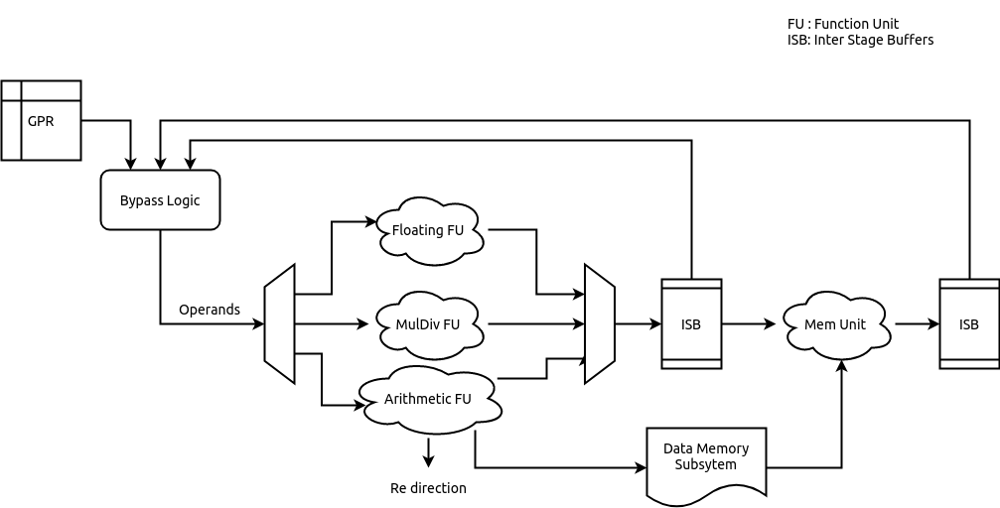
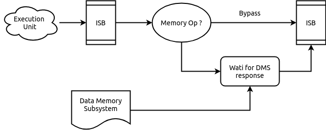

.. _chromite_core:

#############
Core Pipeline
#############

This chapter discusses the micro-architecture and features of the core pipeline. 
The core pipeline consists of the following stages:

- Program Counter Generation Stage (PC Gen)
- Instruction Fetch Stage (IFS)
- Decode Stage
- Execution Stage
- Memory Stage
- Write Back Stage

The following sections provide specific details of each stage.

The pipeline diagram is shown in :numref:`chromite_pipeline`

.. _chromite_pipeline:

.. figure:: chromite_pipeline-2.png
   :align: center

   Pipeline Diagram

PC Gen Stage
============

The PC Gen stage is responsible for generating the next value of the PC to be fetched.
All PCs are virtual/logical addresses. The translation of these into physical addresses is carried
out by the Translation Lookaside Buffers (TLBs) and Page Table Walk (PTW) units in the 
Instruction Memory Subsystem (IMS). The translation is
based on the supervisor spec defined in the *RISC-V Privileged Spec*.
The PC Gen stage also includes, an optional (chosen at design time), Branch Predictor Unit (BPU) for predictive
conditional/unconditional control instructions for improved performance. The BPU can be enabled/disabled 
at runtime through the custom control CSR (:numref:`custom_control_csr`). 

.. tip:: Disabling the BPU can prove to be useful for more deterministic and secure execution environments.

While the next value of the PC is determined, the current value of the PC is fed into the 
Instruction Memory Subsystem (IMS), and forwarded to the IFS as well. 
Information about the prediction of the current PC in from the BPU is also passed on to the IFS.

Next PC Generation
------------------

The Next PC source can be any of the following:

1. **Default**: by default the next PC is assigned as PC + 4.
Even if the compressed extension is enabled, the next PC generated is always 4 bytes aligned. 
This alignment constraint is discussed in more detail in :numref:`pc_alignment`

2. **Trap redirection**: If the write-back stage takes a trap (due to interrupts, exceptions,
environment calls, etc), then the next PC is set to the
value available in the corresponding trap vector CSR (Control and Status Register) which is 
supplied by the write-back stage itself.

3. **Control instruction resolution**: When control instructions (branches, jumps, calls and
returns) are resolved in the pipeline, the execution stage indicates a re-direction of the PC
while providing the target address. 
When BPU is enabled, only mispredictions of control instructions detected in the execution stage cause 
a re-direction request to the PC-Gen stage.

4. **Internal Re-directions**: CSR instructions and *fence.i/sfence.vma* instructions cause the 
next instruction to be fetched again. The PC of the next instruction is provided by the write-back stage. 

5. **Branch Prediction**: When the BPU is enabled, it predicts if the current PC points to a
control instruction and computes the next PC. If the branch predictor predicts that a control
instruction is taken, then the next PC is assigned to the target address provided by the BPU.

.. figure:: pc-gen-wbpu.png
   :align: center
   :height: 400px

   PC Gen Stage Block diagram

Handling Fence Ops
------------------

When a *fence.i* or *sfence.vma* instruction reaches the write-back stage it initiates a re-fetch of the
subsequent instruction and causes the pipeline to flush. When this flush signal is received by the PC Gen 
stage, it forwards the *fence.i/sfence.vma* request to the IMS in the subsequent cycle.
In the next cycle, the new PC arrived with the flush, is passed (after re-adjustment as described in 
:numref:`pc_alignment`) to the IMS and the IFS.

When the branch predictor is enabled and a *fence.i* flush is received, then the entries in the BPU
are also flushed. In case of a *sfence.vma* flush, the predictor is idle when the *sfence.vma* is being
forwarded to the IMS

.. _pc_alignment:

PC Alignment
------------

The logical address sent to the IMS is always 4-byte aligned.  
When the compressed extension is enabled, it possible for any of the following sources
to produce a PC that is 2-byte aligned, as opposed to being 4-byte aligned:

- that target address of a resolved control instruction can be 2-byte aligned.
- The next instruction after *fence.i/sfence.vma* is at a 2 byte a boundary.
- the current PC could point to a control instruction which is predicted taken by the BPU, and the
  new target address is 2 byte aligned.

When any of the above scenarios occur, the PC is re-adjusted to point to the immediate lower 4-byte
boundary:

.. math:: PC = (PC >> 2) << 2 

The re-adjusted PC is then sent to the IMS and the IFS. The IFS is also sent additional
information to indicate that the lower 2 bytes of the response from the IFS for the current
re-adjusted PC have to be ignored and the PC value to be doctored accordingly.

.. note:: If the PC from the above sources are naturally aligned at 4-byte boundaries then no
   re-adjustment is required. 

Enqueuing Packets
-----------------

The PC Gen Stage feeds information/data to the IMS and the instruction fetch
stage. 
A *fence.i* or *sfence.vma* request is sent only to the IMS and not to the instruction fetch stage as the
IMS is not expected to respond to *fence.i*/*sfence.vma* ops.

In general, information/data can be sent to the IMS or the instruction fetch stage only when neither
of the two are stalling and are capable of accepting new packets.

Branch Prediction Unit
----------------------

To improve performance, a gshare based global branch predictor is
implemented. It consists of a fully-associative Branch
Target Buffer (BTB) with 32 entries, 
a 512 entry Branch History Table (BHT) and a
8 entry Return Address Stack (RAS).

.. note:: Each of the parameters above are configurable at design time.

.. figure:: bpu.png
   :align: center
   :height: 400px

   Branch Predictor Unit

The BTB is trained with all control instructions (conditional and unconditional), but holds 
the target only for conditional branches and *CALL* instructions. 
The target addresses for *RET* instructions are maintained in the RAS.

The fully associative BTB leverages the one-hot indexing mechanism to achieve higher frequency
closure. A basic round-robin replacement policy is employed by the BTB. Each entry in the BTB holds the
following fields:

- The logical PC pointing to a control instruction
- The target PC where the next PC should re-direct to
- A 2-bit field indicating the type of the control instruction: *CALL*, *RET*, *JAL* or *BRANCH*
- A valid bit indicating if the entry is valid.
- A boolean field indicating if the logical PC contains a 16 bit control instruction
- A boolean field indicating if the logical PC starts at a 2-byte boundary. This is used to
  calculate the next return address for a *CALL* instruction.

During the prediction phase when a new PC is provided, the BPU performs a lookup in the BTB.
On a hit in the BTB, the control instruction type is checked. If the instruction type is *RET* then 
the target PC is obtained (and removed) from the RAS  else the target PC is picked from the 
BTB entry itself. When a *CALL* instruction is encountered, the immediate next PC value is pushed into
the RAS.
When compressed extension is supported, the offset of the PC to be pushed in to the RAS in case of a
*CALL* instruction is calculated depending on whether it was a 2-byte or a 4-byte instruction
starting at a 2-byte or a 4-byte boundary. This information is stored in the BTB fields as mentioned
above.

Each entry in the BHT table holds a 2-bit counter variable indicating a conditional branch should be
taken or not-taken. The MSB specifies the prediction and the LSB specifies the hysteresis 
(how “strong” the prediction is). The state machine for the update of the BHT entries is shown in
:numref:`hysterisis_diag`. This update happens at the time of the branch resolution in the execution
stage. 

.. _hysterisis_diag:

.. figure:: bht_hysterisis.png
  :align: center
  :height: 300px

  The Two bit counter state machine.

The core uses a 8-bit history register (configurable at design time). 
This register is passed along the pipe upto the execution stage for the purpose of rolling back in case
of a mis prediction. During the prediction phase, the BHT table is indexed using a hash function of the PC and the
history register. When the BTB is a hit and the control instruction is of *BRANCH* type, the BHT table entry dictates if the
branch is taken or not-taken.

When a control instruction reaches the execution stage, it sends feedback on whether the prediction
of the control instruction was correct or not. In case of a misprediction, if the PC does not exist
in the BTB already then it is allocated a new entry and the BHT table is updated if the control
instruction is a branch. If the entry already exists then only the BHT is updated for a branch
instruction. On a misprediction the history register is also rolled back.

When compressed extension is enabled, the BPU provides 2 predictions, one for PC and another for PC
+ 2. This is done by splitting the total BHT entries into 2 banks which are selected by the LSB
bit of the hash function.

.. note:: When a *fence.i* instruction is executed by the pipeline, all entries in the BTB are invalidated.

Instruction Fetch Stage (IFS)
=============================

This stage interacts with PC Gen stage and to send a 32-bit
instruction to the decode stage.

The IFS receives the following information from the PC Gen Stage:

  - The PC value which is always 4-byte aligned.
  - Boolean value indicating if the lower 2 bytes of the IMS should be ignored or not. This is set
    when the PC Gen Stage generates a 2-byte aligned PC. This field also dictates actual value of
    the PC to be to the decode stage along with the instruction.
  - Prediction information from the BPU (which is used and passed onto the next stage for resolution).

The IFS receives the following from the IMS:

  - 4 bytes of the instruction memory based on the address provided by the PC Gen stage
  - A boolean value indicating if a trap occurred during the fetch of those 4 bytes. 
  - A 6-bit field indicating the cause value of the trap (if
    occurred).

When compressed extension is enabled, the 4-bytes received from the IMS can be inferred as any of
the following:

1. A complete non-compressed 32-bit instruction starting at a 4-byte aligned address.
2. Two compressed 16-bit instructions.
3. Lower 2-bytes represent the upper 16 bits of a non-compressed 32-bit instruction.
   The upper 2-bytes of the response represent either a compressed 16-bit instruction or the
   lower 16-bits of a non-compressed 32-bit instruction.
4. The lower 2-bytes represent a compressed 16-bit instruction and the upper 2-bytes represent the
   lower 16-bits of a non-compressed 32-bit instruction.

Thus, to accommodate the above scenarios the IFS maintains a small state-machine and a few storage
elements to create valid instructions, that can be passed on to the decode stage.
:numref:`ifu_diag` shows the state machine implemented.

.. _ifu_diag:

.. figure:: ifu.png
  :align: center

  State machine to extract compressed and non-compressed instructions

If the output of the state-machine is a compressed instruction, it is 
decompressed to an equivalent 32-bit instruction before being passed on to the decode stage.

.. note:: This decompression is possible only because every instruction of the compressed ISA of 
   the RISC-V is has an equivalent 32-bit representation. By decompressing a compressed instruction
   in this stage, the remaining stages in the pipeline have to be modified minimallu to support the
   compressed extension.

Traps and their corresponding cause values are simply buffered and sent to the next stage along with
the instruction.

Enqueuing Instructions
----------------------

The IFS will enqueue an instruction only if the next ISB (Inter Stage Buffer) can accept a new
instruction and a valid instruction is available from the IMS.

Decode Stage
============

The decode stage is responsible for decoding the 4-bytes of instruction received from the 
instruction fetch stage. The decoded information is used to fetch operands from the register-file
for the execution stage.

The decoder function primarily extracts the following information from the 4-bytes of instruction received:

- **Operand indices**: Captures the index of *rs1*, *rs2* and *rd* used by the instruction. In case an
  instruction does not use any of these, then the decoder assigns it to zero
  When floating-point extension is enabled, *rs3* is also decoded
- **Immediate Value**: The decoder also deduces the *immediate* field encoding and produces a 32 bit
  value.
- **Operand type**: This field indicates the source of the operands and destination registers. *rs1* could
  either be sourced from the register files or be assigned the value of PC. *rs2* could either be
  sourced from the register files or be assigned the *immediate* value or a constant value depending
  on the instruction. 
  When floating-point extension is enabled, *rd* could point to either the integer or the floating-point 
  register file
- **Instruction Type**: This field classifies the instruction into one of the following types:
  Arithmetic, Memory, Branch, *JAL*, *JALR*, *CSR-OP*, *TRAP*, *WFI*
  , MULDIV 
  , FLOAT  
  .
- **Function Opcode**: The decoder uses the funct3 and funct7 fields of the instruction to re-encode
  a new 7 bit field to be used by the execution stage.

Register File
-------------

The decode stage maintains two register files: one for integer and one for floating-point registers.
Each of which includes 32 registers. The integer register file has 2 read ports and 1 write port
while the floating-point register file requires 3 read ports and 1 write port.

When debug support is enabled the register file(s) are provided with an extra read port for the
debugger to access the registers directly.

On reset, 32 cycles are used to individually reset each register to 0. During this initialization,
phase the decode stage does not accept any new instruction bytes from the IFS.
The initialization of the floating and register files happen in parallel and thus only 32 cycles are
required to initialize both.

Operand Fetch
-------------

Once the operand indices are available, they are used to fetch the latest value of the operands from
the respective register files. Based on the operand type fields, the register file values are either
used or discarded. During simultaneous read-writes to the same register, the register files perform
a full-bypass, i.e. the value being written in the current cycle is directly consumed by the
instruction during operand fetch.

Trap Handling
-------------

All interrupts to the hart (local or external) are detected in the decode stage. Illegal
traps and traps received from the previous stage are captured here and processed for the
next stage. 

When a trap is detected, the decode stage is stalled (it will no longer
accept new instructions from the IFS) until a re-direction from the execute-stage or
the write-back stage is received. This prevents the flooding the pipeline with more instructions when
a trap re-direction is expected.

WFI Handling
------------

When a *WFI* (Wait for Interrupt) instruction is detected, the decode stage is stalled from the
subsequent cycle onwards. The stage resumes only when an interrupt (local or external) is
detected. 

CSR op Handling
---------------

For CSR ops, the validation of the access is performed in the decode stage. If the validation fails,
the instruction is tagged as an Illegal Trap instruction 

Presently, all CSR operations flush the pipeline, therefore, when a CSR instruction is detected 
the decode stage stalls from the subsequent cycle until a re-direction signal is received from 
either the execution stage or the write-back stage.

Execution Stage
===============

This stage encapsulates all the functional units required to initiate/complete the execution of an
instruction. Operand bypass is also implemented in this stage to feed the latest value of the
operands to the functional units. 

.. note:: Even if one of the functional units is busy, then entire stage is stalled in that cycle and
   no new packets are processed from the decode stage. 

The various functional units (FUs) instantiated in the design can be seen in :numref:`alu_fus`

.. _alu_fus:

  Execution Stage
  
Operand Bypass
--------------

The stage implements a basic operand bypass mechanism which checks for each operand if any of the 2
ISBs further in the pipe are likely sources of the latest value. If the
values are available in the ISBs they are consumed by the bypass logic and fed to the respective
functional stages, else the execution stage is stalled until all the operands are available.

Arithmetic Ops
--------------

All arithmetic and logical ops such as *add, sub, xor, shifts, etc* are implemented as single cycle
combinational operations in this unit. Once the operands are available, the operation is performed and
enqueued to the next ISB.

Control Ops
-----------

Control instruction resolution also occurs in this stage. The comparison logic of the Arithmetic ops 
is re-used to detect if a branch is taken or not. 
The target address for all control instructions is calculated using a dedicated adder.
When the branch predictor is enabled, based on the actual outcome of the control instruction 
the BHT and BTB tables are sent training information which can improve predictions. 
The execution stage generates a re-direction/flush of the previous pipeline stages only when a
misprediction occurs. In order to detect a misprediction, the calculated target address is compared
to the PC of the next instruction. However, if the next instruction has not entered the pipe
yet (possibly due to stalls in the IMS) the execution of the control instruction is stalled as well.
The re-direction also involves sending the correct target address to the PC Gen stage.

Memory Ops
----------

For memory operations, the target address is calculated in this stage (using a dedicated adder) and 
latched to the data memory subsystem (DMS). For load operations the address is calculated as soon as
the latest value of *rs1* is obtained, while for stores, the address is calculated only when both *rs1*
and *rs2* are available.

Trap Handling
-------------

If an incoming decoded instruction is tagged as a trap instruction, it simply bypasses the execution
stage. On the other hand, the execution stage also detects mis-aligned traps for the memory and
control instructions based on the target addresses generated.

Multiply/Divide Unit
--------------------

The execution stage utilizes a multi-cycle integer multiply / divide unit to support the M
extension of RISC-V. The multiplier is implemented as a re-timed module whose latency 
is 2 cycle(s). Divider on the other hand implements a 
non-restoring algorithm which produces the output at the end of
32 cycle. 

.. note:: The core does not flush/retire a divide instruction mid-operation. 

Floating Point Unit
-------------------

The optional floating-point unit (FPU), compliant with the IEEE-754 2008 standard is also
instantiated within the execution stage. The FPU supports single and double precision computations,
with de-normals handling and all six standard rounding modes.

The FPU uses a re-timed fused-multiply-accumulate unit to perform addition, subtraction and FMA operations. 
The latency of the pipeline can be configured at design time. When double precision is enabled at design time,
the unit itself performs the single-precision operations with additional conversion latencies. 
The FPU uses variable latency, iterative units to perform division and square-root.

Memory Stage
============

The memory-stage bypasses all non-memory instructions, and waits for a response from the DMS for
memory operations initiated in the execution stage.
In case of the load instructions, the data-cache in the DMS responds with the loaded value. 
In case a trap has occurred while performing the memory operation, the DMS response holds the
virtual address of the memory operation which caused the trap.
When a store operation is encountered, an entry in the store-buffer is allocated without actually
performing a store. The actual store is reflected in memory only when the instruction reaches the
write-back stage.

When a load operation is encountered in the memory-stage it consumes any updated bytes from the
store-buffer if the requested address match those in the store-buffer.

When the data cache is enabled and a cached store is encountered, the data cache only carries out
actions to ensure the required line is available in the cache. Non cacheable stores work similarly
as mentioned above.
In the case of store operations the data-cache response simply indicates if store can be performed.

:numref:`mem_stage` shows the working of the memory-stage.

.. _mem_stage:

   Memory Stage working

Write Back Stage
================

The write-back stage updates the register file, and also handles traps. In case of traps,
the respective CSRs are updated as described in the privileged RISC-V ISA spec and a re-direction
to the trap vector is initiated, causing a flush of the pipeline. More details regarding interrupts
is available in :numref:`interrupts`.

All CSR operations (read/modify/update) are performed completely in this stage. 
Since the CSRs are implemented as a daisy chain, some CSR accesses can take multiple cycles.
More information on the CSR daisy chain is available in :numref:`daisy_chain`.

All stores are committed in the write-back stage. A signal is sent to the store buffer from the
write-back stage to perform the store. 
When data cache is enabled and the store operation is cached, the write-back stage does not expect
an acknowledgement. In case of non-cached stores the write-back stage will wait for an
acknowledgement from the interconnect for fail/success of the store and raise appropriate exceptions
if required.

Handling Re-directions
======================

The execution stage and the write-back stage are capable of generating re-direction signals causing
the entire pipeline to be flushed. The execution stage generates a redirection in the case of
branch misprediction (if the BPU is enabled), or for control flow instructions that are taken (if
BPU is disabled). The write-back stage on the other hand will generate re-directions for traps 
if an instruction (such as CSR ops) require a re-run of the subsequent instructions.

To account for this with little impact on timing and area, the pipeline implements epoch registers
within each pipeline stage. The epoch register contents are not modified for a stream 
of instructions until a re-direction is generated from pipeline. The re-directions cause the epochs
to toggle and thus, each stage will either process the instruction if the epoch values matches or 
else drop the instruction on a mis-match.

Instruction Latencies
=====================

The pipeline is optimized to provide a peak performance of one instruction per cycle. However, there
are exceptions to this:

- The Load to use latency is 1, assuming a cache hit
- All CSR operations occur at the write-back stage. Considering a daisy chain architecture, a CSR
  operation can take anywhere between 1 to 7 cycles depending on the CSR being accessed.
- All multiplication operations take 2 cycle(s).
- All division operations take 32 cycle(s).
