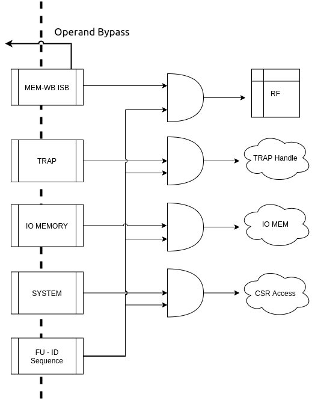

.. _chromite_core:

#############
Core Pipeline
#############

This chapter discusses the micro-architecture and features of the core pipeline. 
The core pipeline consists of the following stages:

- Program Counter Generation Stage (PC Gen)
- Instruction Fetch Stage (IFS)
- Decode Stage
- Execution Stage
- Memory Stage
- Write Back Stage

The following sections provide specific details of each stage.

The pipeline diagram is shown in :numref:`chromite_pipeline`

.. _chromite_pipeline:

.. figure:: chromite_pipeline-2.png
   :align: center

   Pipeline Diagram

PC Gen Stage [stage0.bsv]
=========================

The PC Gen stage is responsible for generating the next value of the PC to be fetched. Once reset is
de-asserted and the :numref:`reset_sequence` is complete, the PC register in this module is assigned 
the value of `reset-pc` (an input to the module). All other functionality only takes action after 
this initialization is done.

All PCs are virtual/logical addresses. The translation of these into physical addresses is carried
out by the Translation Lookaside Buffers (TLBs) and Page Table Walk (PTW) units in the 
Instruction Memory Subsystem (IMS). The translation is
based on the supervisor spec defined in the *RISC-V Privileged Spec*.

The PC Gen stage also includes, an optional (chosen at design time), Branch Predictor Unit (BPU) for predictive
conditional/unconditional control instructions for improved performance. The BPU can be enabled/disabled 
at runtime through the custom control CSR (:numref:`custom_control_csr`). 

.. tip:: Disabling the BPU can prove to be useful for more deterministic and secure execution environments.

While the next value of the PC is determined, the current value of the PC is fed into the 
Instruction Memory Subsystem (IMS), and forwarded to the IFS as well. 
Information about the prediction of the current PC in from the BPU is also passed on to the IFS.

Next PC Generation
------------------

The Next PC source can be any of the following:

1. **Default**: by default the next PC is assigned as PC + 4.
Even if the compressed extension is enabled, the next PC generated is always 4 bytes aligned. 
This alignment constraint is discussed in more detail in :numref:`pc_alignment`

2. **Trap redirection**: If the write-back stage takes a trap (due to interrupts, exceptions,
environment calls, etc), then the next PC is set to the
value available in the corresponding trap vector CSR (Control and Status Register) which is 
supplied by the write-back stage itself.

3. **Control instruction resolution**: When control instructions (branches, jumps, calls and
returns) are resolved in the pipeline, the execution stage indicates a re-direction of the PC
while providing the target address. 
When BPU is enabled, only mispredictions of control instructions detected in the execution stage cause 
a re-direction request to the PC-Gen stage.

4. **Internal Re-directions**: CSR instructions and *fence.i/sfence.vma* instructions cause the 
next instruction to be fetched again. The PC of the next instruction is provided by the write-back stage. 

5. **Branch Prediction**: When the BPU is enabled, it predicts if the current PC points to a
control instruction and computes the next PC. If the branch predictor predicts that a control
instruction is taken, then the next PC is assigned to the target address provided by the BPU.

   PC Gen Stage Block diagram

Handling Fence Ops
------------------

When a *fence.i* or *sfence.vma* instruction reaches the write-back stage it initiates a re-fetch of the
subsequent instruction and causes the pipeline to flush. When this flush signal is received by the PC Gen 
stage, it forwards the *fence.i/sfence.vma* request to the IMS in the subsequent cycle.
In the next cycle, the new PC arrived with the flush, is passed (after re-adjustment as described in 
:numref:`pc_alignment`) to the IMS and the IFS.

When the branch predictor is enabled and a *fence.i* flush is received, then the entries in the BPU
are also flushed. In case of a *sfence.vma* flush, the predictor is idle when the *sfence.vma* is being
forwarded to the IMS

.. _pc_alignment:

PC Alignment
------------

The logical address sent to the IMS is always 4-byte aligned.  
When the compressed extension is enabled, it possible for any of the following sources
to produce a PC that is 2-byte aligned, as opposed to being 4-byte aligned:

- that target address of a resolved control instruction can be 2-byte aligned.
- The next instruction after *fence.i/sfence.vma* is at a 2 byte a boundary.
- the current PC could point to a control instruction which is predicted taken by the BPU, and the
  new target address is 2 byte aligned.

When any of the above scenarios occur, the PC is re-adjusted to point to the immediate lower 4-byte
boundary:

.. math:: PC = (PC >> 2) << 2 

The re-adjusted PC is then sent to the IMS and the IFS. The IFS is also sent additional
information to indicate that the lower 2 bytes of the response from the IFS for the current
re-adjusted PC have to be ignored and the PC value to be doctored accordingly.

.. note:: If the PC from the above sources are naturally aligned at 4-byte boundaries then no
   re-adjustment is required. 

Enqueuing Packets
-----------------

The PC Gen Stage feeds information/data to the IMS and the instruction fetch
stage. 
A *fence.i* or *sfence.vma* request is sent only to the IMS and not to the instruction fetch stage as the
IMS is not expected to respond to *fence.i*/*sfence.vma* ops.

In general, information/data can be sent to the IMS or the instruction fetch stage only when neither
of the two are stalling and are capable of accepting new packets.

Branch Prediction Unit
----------------------

To improve performance, a gshare based global branch predictor is
implemented. It consists of a fully-associative Branch
Target Buffer (BTB) with 32 entries, 
a 512 entry Branch History Table (BHT) and a
8 entry Return Address Stack (RAS).
All of which is configurable at compile time by setting the :ref:`branch_predictor` parameters.

.. note:: Each of the parameters above are configurable at design time.

   Branch Predictor Unit

The BTB is trained with all control instructions (conditional and unconditional), but holds 
the target only for conditional branches and *CALL* instructions. 
The target addresses for *RET* instructions are maintained in the RAS.

The fully associative BTB leverages the one-hot indexing mechanism to achieve higher frequency
closure. A basic round-robin replacement policy is employed by the BTB. Each entry in the BTB holds the
following fields:

- The logical PC pointing to a control instruction
- The target PC where the next PC should re-direct to
- A 2-bit field indicating the type of the control instruction: *CALL*, *RET*, *JAL* or *BRANCH*
- A valid bit indicating if the entry is valid.
- A boolean field indicating if the logical PC contains a 16 bit control instruction
- A boolean field indicating if the logical PC starts at a 2-byte boundary. This is used to
  calculate the next return address for a *CALL* instruction.

During the prediction phase when a new PC is provided, the BPU performs a lookup in the BTB.
On a hit in the BTB, the control instruction type is checked. If the instruction type is *RET* then 
the target PC is obtained (and removed) from the RAS  else the target PC is picked from the 
BTB entry itself. When a *CALL* instruction is encountered, the immediate next PC value is pushed into
the RAS.
When compressed extension is supported, the offset of the PC to be pushed in to the RAS in case of a
*CALL* instruction is calculated depending on whether it was a 2-byte or a 4-byte instruction
starting at a 2-byte or a 4-byte boundary. This information is stored in the BTB fields as mentioned
above.

Each entry in the BHT table holds a 2-bit counter variable indicating a conditional branch should be
taken or not-taken. The MSB specifies the prediction and the LSB specifies the hysteresis 
(how “strong” the prediction is). The state machine for the update of the BHT entries is shown in
:numref:`hysterisis_diag`. This update happens at the time of the branch resolution in the execution
stage. 

.. _hysterisis_diag:

  The Two bit counter state machine.

The core uses a 8-bit history register (configurable at compile time). 
This register is passed along the pipe upto the execution stage for the purpose of rolling back in case
of a mis prediction. During the prediction phase, the BHT table is indexed using a hash function of the PC and the
history register. When the BTB is a hit and the control instruction is of *BRANCH* type, the BHT table entry dictates if the
branch is taken or not-taken.

When a control instruction reaches the execution stage, it sends feedback on whether the prediction
of the control instruction was correct or not. In case of a misprediction, if the PC does not exist
in the BTB already then it is allocated a new entry and the BHT table is updated if the control
instruction is a branch. If the entry already exists then only the BHT is updated for a branch
instruction. On a misprediction the history register is also rolled back.

When compressed extension is enabled, the BPU provides 2 predictions, one for PC and another for PC
+ 2. This is done by splitting the total BHT entries into 2 banks which are selected by the LSB
bit of the hash function.

.. note:: When a *fence.i* instruction is executed by the pipeline, all entries in the BTB are invalidated.

Instruction Fetch Stage (IFS) [stage1.bsv]
==========================================

This stage interacts with PC Gen stage and the IMS to send a 32-bit
instruction to the decode stage.

The IFS receives the following information from the PC Gen Stage:

  - The PC value which is always 4-byte aligned.
  - Boolean value indicating if the lower 2 bytes of the IMS should be ignored or not. This is set
    when the PC Gen Stage generates a 2-byte aligned PC. This field also dictates actual value of
    the PC to be to the decode stage along with the instruction.
  - Prediction information from the BPU (which is used and passed onto the next stage for resolution).

The IFS receives the following from the IMS:

  - 4 bytes of the instruction memory based on the address provided by the PC Gen stage
  - A boolean value indicating if a trap occurred during the fetch of those 4 bytes. 
  - A 6-bit field indicating the cause value of the trap (if
    occurred).

When compressed extension is enabled, the 4-bytes received from the IMS can be inferred as any of
the following:

1. A complete non-compressed 32-bit instruction starting at a 4-byte aligned address.
2. Two compressed 16-bit instructions.
3. Lower 2-bytes represent the upper 16 bits of a non-compressed 32-bit instruction.
   The upper 2-bytes of the response represent either a compressed 16-bit instruction or the
   lower 16-bits of a non-compressed 32-bit instruction.
4. The lower 2-bytes represent a compressed 16-bit instruction and the upper 2-bytes represent the
   lower 16-bits of a non-compressed 32-bit instruction.

Thus, to accommodate the above scenarios the IFS maintains a small state-machine and a few storage
elements to create valid instructions, that can be passed on to the decode stage.
:numref:`ifu_diag` shows the state machine implemented.

.. _ifu_diag:

  State machine to extract compressed and non-compressed instructions

If the output of the state-machine is a compressed instruction, it is 
decompressed to an equivalent 32-bit instruction before being passed on to the decode stage.

.. note:: This decompression is possible only because every instruction of the compressed ISA of 
   the RISC-V is has an equivalent 32-bit representation. By decompressing a compressed instruction
   in this stage, the remaining stages in the pipeline have to be modified minimallu to support the
   compressed extension.

Traps and their corresponding cause values are simply buffered and sent to the next stage along with
the instruction.

Enqueuing Instructions
----------------------

The IFS will enqueue an instruction only if the next :term:`ISB` (Inter Stage Buffer) can accept a new
instruction and a valid instruction is available from the IMS.

Decode Stage [stage2.bsv]
=========================

The decode stage is responsible for decoding the 4-bytes of instruction received from the 
instruction fetch stage. The decoded information is used to fetch operands from the register-file
for the execution stage.

The decoder function primarily extracts the following information from the 4-bytes of instruction received:

- **Operand indices**: Captures the index of *rs1*, *rs2* and *rd* used by the instruction. In case an
  instruction does not use any of these, then the decoder assigns it to zero
  When floating-point extension is enabled, *rs3* is also decoded
- **Immediate Value**: The decoder also deduces the *immediate* field encoding and produces a 32 bit
  value.
- **Operand type**: This field indicates the source of the operands and destination registers. *rs1* could
  either be sourced from the register files or be assigned the value of PC. *rs2* could either be
  sourced from the register files or be assigned the *immediate* value or a constant value depending
  on the instruction. 
  When floating-point extension is enabled, *rd* could point to either the integer or the floating-point 
  register file
- **Instruction Type**: This field classifies the instruction into one of the following types:
  Arithmetic, Memory, Branch, *JAL*, *JALR*, *CSR-OP*, *TRAP*, *WFI*
  , MULDIV 
  , FLOAT  
  .
- **Function Opcode**: The decoder uses the funct3 and funct7 fields of the instruction to re-encode
  a new 7 bit field to be used by the execution stage.

Register File
-------------

The decode stage maintains two individual register files: one for integer and one for floating-point registers.
Each of which includes 32 registers. The zeroth register of the integer register file is hardwired
to zero. The integer register file has 2 read ports and 1 write port
while the floating-point register file requires 3 read ports and 1 write port for the current set of
instructions that are supported.

On reset, 32 cycles are used to individually reset each register to 0. During this initialization,
phase the decode stage does not accept any new instruction bytes from the IFS.
The initialization of the floating and register files happen in parallel and thus only 32 cycles are
required to initialize both.

However, if at compile time the `merged_rf` configuration is enabled, then the integer and floating
point registers are both maintained as a single 64-entry registerfile, with the top 32 registers
allocated for integer and the bottom 32 for floating point. During read/write the type of
operand/destination register is used to define the MSB bit of the 6-bit index into the
merged register file. Additionally, in the merged register file scenario, the reset sequences takes
64 cycles instead of 32.

Operand Fetch
-------------

Once the operand indices are available from the decoder, they are used to fetch the latest value of 
the operands from the respective register files. Based on the operand type fields, the register file 
values are either used or discarded. During simultaneous read-writes to the same register, the 
register files perform a full-bypass, i.e. the value being written in the current cycle is 
directly consumed by the instruction during operand fetch.

Trap Handling
-------------

All interrupts to the hart (local or external) are detected in the decode stage. Illegal
traps and traps received from the previous stage are captured here and processed for the
next stage. 

When a trap is detected, the decode stage is stalled (i.e. it will no longer
accept new instructions from the IFS) until a re-direction from the execute-stage or
the write-back stage is received. This prevents the flooding the pipeline with more instructions when
a trap re-direction is expected.

Micro Traps
-----------

The core also supports micro-traps (a.k.a hidden traps) which are used to carry out architecturally 
hidden actions by leveraing the same TRAP mechanism and artifacts throughout the pipeline. While micro
traps are detected in the decode stage, their actions may be initiated all the way from the
write-back stage of the pipeline. The following micro-traps are currently supported:

 - Rerun on CSR: When a csr operation is detected in the decode stage, the subsequent instruction in
   the decoder stage is tagged with a micro-trap. When this instruction reaches the write-back stage
   it issues a flush of the pipeline and resets pc to itself. This is done to ensure that the
   instruction was fetched under the new csr changes.
 - Rerun on FenceI: Same as above, but the instruction after a FenceI is tagged as a micro-trap. This
   is because fencing of the IMS only occurs when the `fence.i` instruction reaches the write-back
   stage and therefore the next fetched instruction must be fetched again.
 - Rerun on SFence: Same as above, but for `sfence.vma` instruction.

Each type of micro-trap is given a custom cause value. When a micro-trap is detected, the instruction is
tagged as a TRAP instruction while an additional boolean field is set indicating that the cause must
interpreted as a micro-trap cause, instead of the regular trap cause.

WFI Handling
------------

When a `WFI` (Wait for Interrupt) instruction is detected, the decode stage is stalled from the
subsequent cycle onwards. The stage resumes only when an interrupt (local or external) is
detected. 

CSR op Handling
---------------

For CSR ops, the validation of the access is performed in the decode stage. If the validation fails,
the instruction is tagged as an Illegal Trap instruction 

Presently, all CSR operations flush the pipeline, therefore, when a CSR instruction is detected 
the decode stage stalls from the subsequent cycle until a re-direction signal is received from 
either the execution stage or the write-back stage.

Execution Stage [stage3.bsv]
============================

This stage encapsulates all the functional units required to initiate/complete the execution of an
instruction. The Scoreboard, used for operand bypass and stalls, is also implemented in this stage. 
A block diagram of the stage is shown in :numref:`exe_stage3`

.. _exe_stage3:

   Execution Stage of the pipeline

.. _scoreboard:

Scoreboard
----------

This scoreboard in its minimal configuration implements a 32-bit register for each architectural
register file (integer and/or floating point). Each bit in this register corresponds to a register
in the respective register file. When a bit is set it indicates that there exists an instruction in
the further stages of the pipeline which holds an updated value of the register which has not been
committed to the register file yet. We refer to this bit as the `lock_bit` as shown in
:numref:`scbd`

When an instruction in the execution stage is dispatched for execution, the lock bit corresponding to the 
the destination register (except x0 of the integer register file) is set to 1 in the scoreboard.
The lock bit is reset to 0 only when the instruction with the same destination register is committed 
in the write-back stage.

When :ref:`waw_stalls` is enabled during compile time, the :ref:`bypass` module (described below) will stall the
pipeline for the instruction which has an operand whose lock bit in the scoreboard is set.

However, when :ref:`waw_stalls` is disabled during compile time, the scoreboard along with the lock bit
maintains a `id` field which corresponds to a unique instruction in the pipeline which holds the
latest value of the register. Thus, when performing bypass, this id is also checked to ensure that
only the latest value of the operand is picked, else a stall is generated.

.. _scbd:

   Scoreboard Structure for the integer register file.

.. _bypass:

Operand Bypass
--------------

The module receives the operands from the registerfile (always holding the latest values as the
registerfile acts as a bypass-registerfile). The module also has access to the current scoreboard
which indicates if there exists an instruction in the further stages of the pipeline with a
potentially new value of the operand.

The sources of the bypass include the head of the :term:`BASE ISB` between EXE-MEM and the head of the ISB 
between MEM-WB. The third source of the bypass is the registerfile itself. Bypass is performed for 
rs1 and rs2. It is also done for rs3 when the F/D extensions are enabled.

The bypass module will indicate if the respective operand is available to initiate execution or not.
When :ref:`waw_stalls` are disabled, then checks on the bypass packets from the ISB will also include
checking if the bypass register `id` matches the corresponding id from the scoreboard.

Functional Units
----------------

The execution stage is divided in multiple independently accessed functional units as shown in
:numref:`exe_stage3`. Each of these functional units perform the execution of a certain subset 
of the instructions. The following functional units are available in the execution stage:

- ALU: This executes basic arithmetic, logic and shift operations
- Branch Resolution Unit (BRU): This will handle all the control instructions and the mispredictions if any
- MBOX : This unit will offload the multiply and divide operations to the mbox module.
- FBOX : This unit will offload the floating point operations to the fbox module.
- AGU  : This unit will generate the address of the memory operation and offload it to the DMS.

Based on the decoded information obtained from the head of the DEC-EXE ISB, one of the functionaly
units is chosen. Only when all operands of the instruction are available is the instruction
offloaded for execution to the respective functional unit.

Note that the ISBs between EXE and MEM stages is split in to multiple smaller ISBs which hold the
results of different functional units. For example, the outputs of the ALU and the BRU, after 
execution are fed in to the :term:`BASE ISB` as shown in :numref:`exe_stage3`. The output of the AGU is 
sent to the :term:`MEMORY ISB`. System instructions (like CSR ops, xRET, etc) are directly buffered into the
:term:`SYSTEM ISB`. 

It is possible that the BRU and AGU generate mis-aligned traps, in which case the result is enqued
into the :term:`TRAP ISB`. All previously decoded traps (from decode and pc-gen stages) are directly
buffered into the TRAP ISB.

As soon as an instruction is offloaded to the respective functional unit, we enqueue the functional
unit id into the :term:`FUID ISB`. This buffer basically indicates the order in which the
instructions in the further pipeline stages must be processed and committed. Simultaneously, the
scoreboard lock bits are updated for destination registers of that insrtuction.

ALU Functional Unit
^^^^^^^^^^^^^^^^^^^

All arithmetic and logical ops such as *add, sub, xor, shifts, etc* are implemented as single cycle
combinational operations in this unit. Once the operands are available, the operation is performed and
enqueued to the BASE ISB.

BRU Functional Unit
^^^^^^^^^^^^^^^^^^^

Control instruction resolution also occurs in this stage. 
The target address for all control instructions is calculated using a dedicated adder.
When the branch predictor is enabled, based on the actual outcome of the control instruction 
the BHT and BTB tables are sent training information which can improve predictions. 
The execution stage generates a re-direction/flush of the previous pipeline stages only when a
misprediction occurs. In order to detect a misprediction, the calculated target address is compared
to the PC of the next instruction. However, if the next instruction has not entered the pipe
yet (possibly due to stalls in the IMS) the execution of the control instruction is stalled as well.
The re-direction also involves sending the correct target address to the PC Gen stage.

AGU Functional Unit
^^^^^^^^^^^^^^^^^^^

For memory operations, the target address is calculated in this stage (using a dedicated adder) and 
latched to the data memory subsystem (DMS). For load operations the address is calculated as soon as
the latest value of *rs1* is obtained, while for stores, the address is calculated only when both *rs1*
and *rs2* are available. The type of memory operation and other information (like size, io, etc) is
captured and enqueued into the MEMORY ISB.

Trap Handling
^^^^^^^^^^^^^

If an incoming decoded instruction is tagged as a trap instruction, it simply bypasses the execution
stage. On the other hand, the execution stage also detects misaligned traps for the memory and
control instructions based on the target addresses generated.

MBOX Functional Unit
^^^^^^^^^^^^^^^^^^^^

The execution stage utilizes a multi-cycle integer multiply / divide unit to support the M
extension of RISC-V. The multiplier is implemented as a re-timed module whose latency 
is 2 cycles. (The latency is controlled at compile time using the parameters mentioned in :ref:`m_extension`.)
Divider on the other hand implements a non-restoring algorithm which produces the output at the end of
32 cycle (latency controlled at design time). 

.. note:: The core does not flush/retire a divide instruction mid-operation. 

Note, that the mbox provides 2 ready signals one for the multiplier unit and one of the divider unit. 
This depending on the next instruction to be executed, the relevant ready signal is probed to ensure
that the execution unit is available for offloading.

Floating Point Unit
^^^^^^^^^^^^^^^^^^^

The optional floating-point unit (FPU), compliant with the IEEE-754 2008 standard is also
instantiated within the execution stage. The FPU supports single and double precision computations,
with de-normals handling and all six standard rounding modes.

The FPU uses a re-timed fused-multiply-accumulate unit to perform addition, subtraction and FMA operations. 
The latency of the pipeline can be configured at design time. When double precision is enabled at design time,
the unit itself performs the single-precision operations with additional conversion latencies. 
The FPU uses variable latency, iterative units to perform division and square-root.

Dropping Instructions
---------------------

Instructions received from the decode stage whose write-back epochs don't match are dropped in this
stage, to prevent unnecessary computations and long flush latencies.

Memory Stage [stage4.bsv]
=========================

This pipeline stage acts as the capturing stage of all execution units and forwards them in 
program order to the write-back stage. The module employs a basic polling technique which is 
governed by the value at the head of the :term:`FUID ISB`. The FUID indicates which Functional 
unit - muldiv, float, base-alu, trap, cache, etc - is supposed to provide the next instruction 
which can be forwarded to the write-back stage.

There can be multiple functional units which can be polled in this stage whose write-back function
is quite similar. Thus, this stage also tries to converge the various FUIDs to Commit Unit ids
(:term:`CUID ISB`) as shown in :numref:`mem_stage4`

.. _mem_stage4:

   Memory Stage of the Pipeline

The system instructions received from the previous stage are simply buffered into the next SYSTEM
ISB, since these can only be performed in the write-back stage. For all other non-memory operations,
once the functional unit responds with the correct result, it is enqueued into the `MEM-WB ISB` as
shown in :numref:`mem_stage4`.

In case of memory operations, this unit waits for a response from the DMS. If the DMS response
indicates that a trap occurred, then the instruction is tagged as a TRAP and the virtual address 
of the operation is captured for the mtval field. In case of cacheable load operations, the result
from the DMS is directly fed in the MEM-WB ISB and is there on treated similar to the other
arithmetic instructions.

However, in case of store ops or non-cacheable ops, the DMS response indicates that a operations has
been buffered and can only be committed from the write-back stage. In such situations, the
instruction results are fed in to the :term:`IO-MEMORY ISB` as shown in :numref:`mem_stage4`.

Write Back Stage [stage5.bsv]
=============================

.. _wb_stage5:

   Write Back stage of the pipeline

The write-back stage of the pipeline is where all instructions retire. By the time an
instruction reaches this stage it has been narrowed down via some of the previous stages into one of
the following categories of operations that can be performed in this stage:

  - SYSTEM: either xRET operations or CSR access operations.
  - TRAP: The instruction has encountered a trap during its operation in one of the previous stages.
  - BASEOUT: The instruction retirement includes a simple update to the registerfile
  - MEMOP: The instruction is either a cached store/atomic operation or an non-cached/IO memory op.

Each of the above have a unique ISB feeding in respective instructions to this module. This module
uses the CUID from the previous stage,  which maintains the order of instructions to find out which
ISB must be polled for retiring/committing the next instruction as shown in :numref:`wb_stage5`

Operations which can take multiple cycles in this stage are : CSR operations if daisy-chain is more
than 1 level deep; IO/non-cached Memory Operations may also take significantly longer in this stage
to complete.

All other ops will take a single cycle to complete.

This module also instantiates the csrbox module, which hosts all the csrs and also the routines to
perform a trap or an xRet operation. Certain csr interfaces are simply bypassed along this module so
that they are exposed at the next hiegher level to rest of the pipeline and design.

Reset Sequence
==============

The reset sequence of the core is quite simple. Once the core reset has been
deasserted the following events start:
  
  - All sets of the instruction cache are invalidated
  - All sets of the data cache are invalidated
  - All the entries in the register file are set to zero
  - All entries in the bht and btb are reset and invalidated

As part of the reset sequence we ensure that stage-0 of the pipeline only
generates the first PC when all the above are done. Since the above events
always take a constant time, we use a counter to count the max number of cycles
required by the above events, and only then the stage-0 logic is enabled.

Handling Re-directions
======================

The execution stage and the write-back stage are capable of generating re-direction signals causing
the entire pipeline to be flushed. The execution stage generates a redirection in the case of
branch misprediction (if the BPU is enabled), or for control flow instructions that are taken (if
BPU is disabled). The write-back stage on the other hand will generate re-directions for traps 
if an instruction (such as CSR ops) require a re-run of the subsequent instructions.

To account for this with little impact on timing and area, the pipeline implements epoch registers
within each pipeline stage. The epoch register contents are not modified for a stream 
of instructions until a re-direction is generated from pipeline. The re-directions cause the epochs
to toggle and thus, each stage will either process the instruction if the epoch values matches or 
else drop the instruction on a mis-match.

Instruction Latencies
=====================

The pipeline is optimized to provide a peak performance of one instruction per cycle. However, there
are exceptions to this:

- The Load to use latency is 1, assuming a cache hit
- All CSR operations occur at the write-back stage. Considering a daisy chain architecture, a CSR
  operation can take anywhere between 1 to 7 cycles depending on the CSR being accessed.
- All multiplication operations take 2 cycle(s).
- All division operations take 32 cycle(s).
