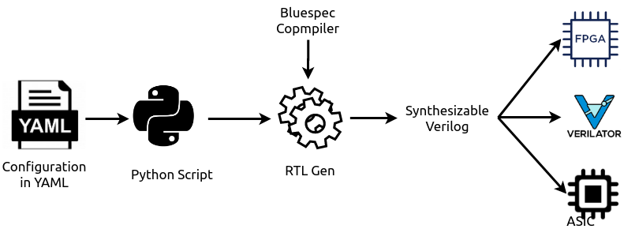

########
Overview
########

Chromite is an open-source core generator, which emits synthesizable, production quality RTL
of processors based on the open `RISC-V ISA <https://riscv.org/>`_. The core generator can produce
variants of a commercial grade 5-stage in-order core supporting the RV[64/32]GCSUN (or its subsets)
extensions of the RISC-V ISA, from the same high-level source code. Chromite leverages the high 
level abstraction offered by Bluespec System Verilog to build highly parameterized, compact and powerful library components (like 
arithmetic units, branch predictors, caches, mmu, etc) that can be seamlessly integrated to create a solution catered to
your needs. 

The configuration to the generator is provided through a very simple and easy to modify 
YAML file. The core generator uses a python script to generate the necessary environment variables
and macros required to generate the RTL. The generated RTL is completely synthesizable and can be 
directly integrated into conventional VLSI flows for FPGA, ASIC or verification.
:numref:`chromite_flow` shows the basic flow of the Chromite core generator.

.. _chromite_flow:

   Chromite Core Generator Flow

The various design instances generated through Chromite can serve domains ranging from embedded 
systems, motor-control, IoT, storage, industrial applications, all the way to low-cost,
high-performance Linux based applications such as networking, gateways etc. 
The extreme parameterization of the design in conjunction with using an HLS like Bluespec, it makes 
it easy to add new features and design points on a continual basis.

Feature list
------------
  
  * 6 stage in-order pipeline
  * 64/32-bit variants available
  * Configurable to support the following RISC-V ISA extensions: RV[64/32][IMAFDCSUN]
  * Supports IEEE-754 based single and double precision Floating Point operations in hardware. These
    units can be configured to meet high-frequency requirements
  * Integrated integer Multiply/Divide units
  * A flexible Co-processor interface to provide  closely-coupled integration of custom accelerators.
  * Supports AXI-4, AXI-4 Lite and TileLink bus protocols
  * Configurable L1 Caches

    * Separate instruction and data caches which can be configured with upto 4-ways and 32KiB
    * Optional ECC support for RAMs
    * Write-back with Write-allocate caches
    * Virtually indexed and physically tagged
    * Can be configured to be used as RAMs during run-time
    * Optimized to use single-ported RAMs
    * Can be disabled/enabled through software
    * Configurable replacement policies: Pseudo LRU, Random, Round-Robin

  * Configurable Memory Management Unit (MMU)

    * Fully-associative and separate instruction and data TLBs with upto 16 entries
    * Supports variable page sizes. 4KiB and 4MiB pages for 32-bit core. 4Kib, 2MiB, 1GiB and 512GiB
      pages for 64-bit cores

  * Physical Memory Protection Unit (PMP):

    * Configurable number of regions : upto 16 can be protected.
    * Can protect upto a granularity of 4 bytes for the 32-bit core and 8 bytes for the 64-bit core.
    * Certain regions can be locked for protection against machine level access as well
    
  * Branch Prediction (BPU):

    * Supports Gshare based branch prediction scheme
    * Fully-associative Branch Target Buffer with upto 64-entries
    * Variable size Branch History Buffer
    * Configurable size of Return Address Stack
    * Ability to disable predictor at runtime through software

  * Daisy Chained CSRs optimized for frequency and scaling
    
    * Allows adding of custom CSRs without having to compromise on frequency
    * Can instantiate up to 32 performance counters

  * Debug support based on the RISC-V Debug spec v0.14
  * Trigger support for data and address.

